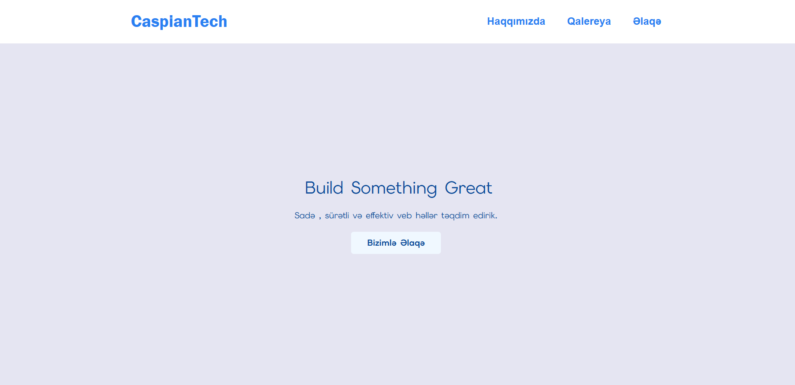
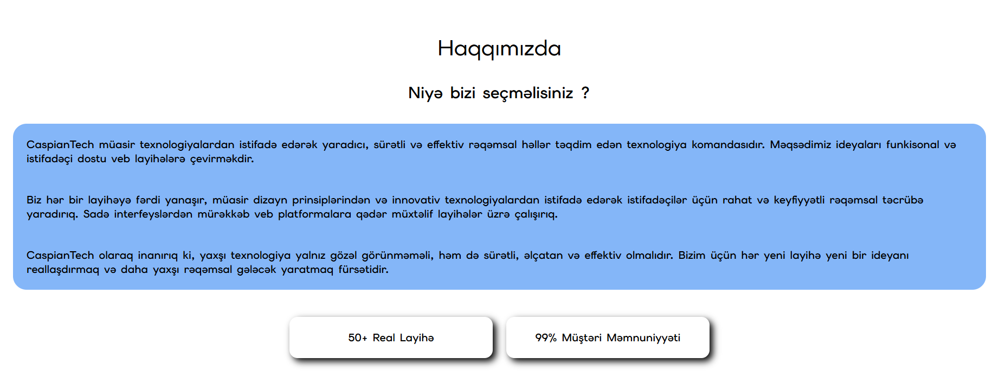
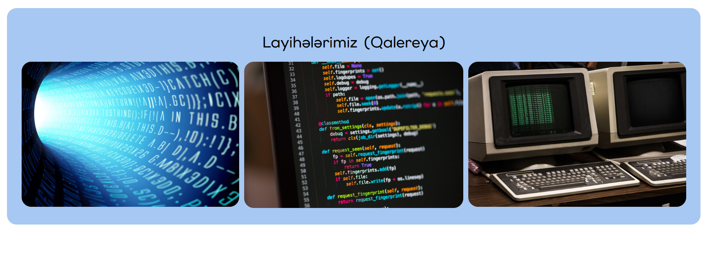
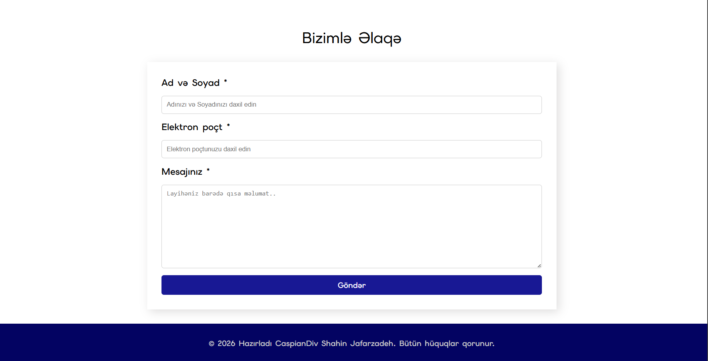

# CaspianTech Landing Page

Sadə, sürətli və effektiv veb həllər təqdim edən **CaspianTech** devJoint task_1 hazırlanmış responsive landing page.

## 📖 Haqqında

Bu layihə CaspianTech adlı (fiktiv) texnologiya şirkəti üçün hazırlanmış tək səhifəlik (one-page) landing page-dir. Layihə HTML5 , CSS3 və VanillaJs  istifadə edərək qurulub və aşağıdakı bölmələrdən ibarətdir:

- **Hero** — Əsas başlıq və "bizimlə əlaqə" düyməsi
- **Haqqımızda (About)** — Şirkət haqqında məlumat və statistika kartları (50+ layihə, 99% müştəri məmnuniyyəti)
- **Qalereya (Projects Gallery)** — Tamamlanmış layihələrin şəkilləri
- **Əlaqə (Contact)** — Ad, e-mail və mesaj sahələri olan əlaqə formu

## 🛠️ İstifadə olunan texnologiyalar

- HTML5
- CSS3
- VanillaJs

## 📸 Ekran görüntüləri

<!-- Aşağıya layihənin ekran görüntülərini əlavə et -->

| Hero bölməsi | Haqqımızda | Qalereya | Əlaqə |
|:---:|:---:|:---:|:---:|
|  |  |  |  |

## 🚀 Necə işə salmaq olar

```bash
git clone https://github.com/username/repo-name.git
cd repo-name
```

Sonra `index.html` faylını brauzerdə açmaq kifayətdir.

## 👤 Müəllif

**Shahin Jafarzadeh** — CaspianDiv

---

## 🇬🇧 English

A clean, responsive one-page landing page built for **CaspianTech**, a (fictional) tech company offering simple, fast, and effective web solutions.

### Sections
- **Hero** — Main heading and call-to-action button
- **About** — Company info with stat cards (50+ projects, 99% client satisfaction)
- **Projects Gallery** — Screenshots of completed projects
- **Contact** — Contact form with name, email, and message fields

### Tech Stack
- HTML5
- CSS3
- VanillaJs

### Screenshots
See the table above — add your own screenshots to a `/screenshots` folder in the repo and update the image paths accordingly.

### Author
**Shahin Jafarzadeh** — CaspianDiv

---

© 2026 CaspianDiv Shahin Jafarzadeh. All rights reserved.